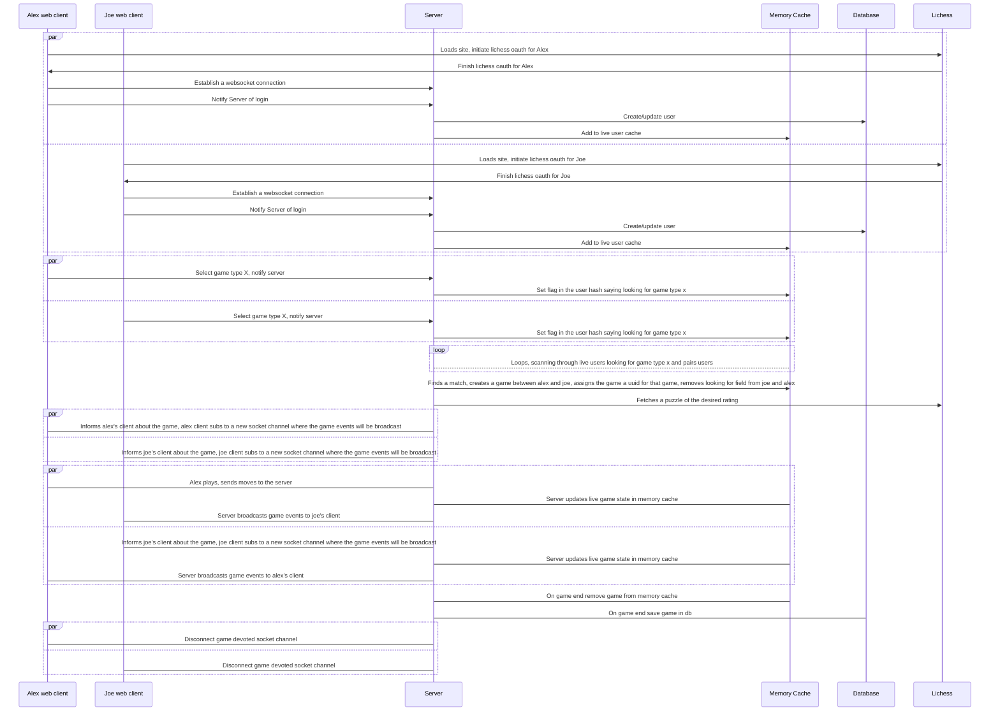

# Puzzle battle server

## What?

App where people compete head to head solving puzzles. A wrong move gifts the other player a free move.

## How does it work?

A nest js graphql server, backed by a redis cache and a nosql database (mongo).

### Development

To create, run, stop and start the docker image, the folloing scripts exist:

`dev:docker:build:redis`
Builds the docker image

`dev:docker:run:redis`
Runs it

`dev:docker:stop:redis`
Stops it

`dev:docker:start:redis`
Starts it

`dev:docker:redis:init`
Executes the scripts against it. This creates the indexes used to query it

Once the docker image is started the ui to it should be accessible at `http://localhost:8001`

Once the redis docker is running, do `npm run start`.

## Games

Sequence diagram for the happy path game flow:

